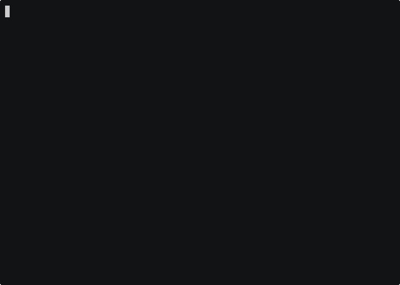

# Relatório de Análise Técnica: Descoberta de Vulnerabilidades

Este documento descreve as informações coletadas durante a análise de um sistema alvo (Metasploitable 2) para identificar falhas de segurança.

## 1. Identificação do Sistema

Ao executar o comando `uname -a`, o sistema revelou ser um Linux muito antigo (versão 2.6.24).

* **Por que isso é um risco?** Sistemas antigos não recebem mais atualizações de segurança. É como deixar uma porta velha com uma fechadura enferrujada; qualquer um que conheça o "jeito certo" consegue abrir.

## 2. Portas e Caminhos de Entrada (Rede)

O comando `netstat -antup` listou as "portas" (serviços) que estão abertas esperando conexões. Pense nelas como janelas abertas em uma casa.

* **Porta 1524 (A "Porta Secreta"):** O arquivo mostra que esta porta está com uma conexão estabelecida (`ESTABLISHED`). No Metasploitable, essa porta é um "backdoor" famoso: se você se conecta a ela, o sistema te dá controle total (root) sem pedir senha.

* **Portas de Banco de Dados (3306 e 5432):** Estão abertas para qualquer um na rede (`0.0.0.0`). Isso permitiria que um invasor tentasse adivinhar senhas para roubar dados dos usuários.

* **Portas 21 (FTP) e 23 (Telnet):** São formas antigas de transferir arquivos e acessar o sistema que mandam tudo (inclusive sua senha) sem criptografia pela rede.

## 3. Usuários Encontrados

Ao ler o arquivo `/etc/passwd`, conseguimos ver uma lista de todos que podem ter conta no sistema.

* **O que foi encontrado:** Além do usuário padrão `msfadmin`, existem contas para serviços como `postgres`, `mysql` e `www-data` (site).

* **Risco:** Se um invasor conseguir entrar no site, ele "vira" o usuário `www-data` e pode tentar atacar o resto do computador de dentro.

## 4. Conclusão da Investigação

O sistema está extremamente vulnerável. Ele possui serviços que dão acesso total sem senha (porta 1524) e roda programas como o servidor de arquivos Samba e o servidor web Apache em versões que hoje são consideradas perigosas.

---